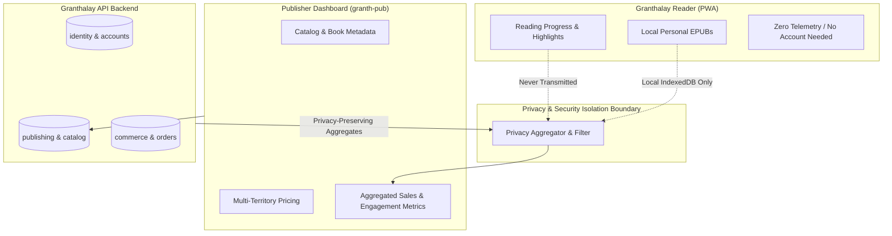

# Data and Privacy Policy

This policy defines the data handling, privacy boundaries, and telemetry guarantees for the Granthalay Publisher Dashboard (`granth-pub`) and its interactions with the Granthalay ecosystem.

---

## 1. Core Privacy Tenets

Granthalay is built on privacy-first foundations. The introduction of publisher features and digital commerce preserves the core guarantees of the reader:

1. **Local-First Reader Independence**: Personal EPUB imports, annotations, reading progress, and typography preferences remain local to the reader's browser (IndexedDB). They are never tracked, transmitted, or accessible to publishers.
2. **Aggregated Analytics Only**: Publishers can only view aggregated, privacy-preserving metrics (such as completed orders, units sold, gross revenue, and aggregated chapter completion quartiles). Individual reader sessions or identities are never revealed.
3. **Publisher Data Ownership**: Publishers maintain control over their metadata, author attributions, book descriptions, and pricing configurations.

---

## 2. Publisher Account and Session Data

### Collected Data
When a publisher registers and manages their catalog on `granth-pub`, the platform processes:
- **Authentication**: Work email, cryptographically hashed passwords (Argon2id/PBKDF2 via Spring Security / Better Auth), and revocable session tokens.
- **Organization Identity**: Legal business entity name, imprint name, contact phone, contact email, country of registration, and business tax identifiers (EIN, VAT, or GST).
- **Financial Details**: Payout routing identifiers (Stripe Connect account IDs or bank IBAN details) held securely by our PCI-DSS compliant payment processor.
- **Catalog Manuscripts**: EPUB manuscripts, cover images, chapter previews, and publication metadata uploaded by the publisher.

### Session Security & Cookies
- Publisher authentication uses `HttpOnly`, `SameSite=Strict`, and `Secure` session cookies.
- CSRF protection is enforced on all state-mutating requests via double-submit or synchronized token patterns (`X-XSRF-TOKEN`).
- Sessions automatically time out after periods of inactivity and can be revoked across all devices from the publisher settings.

---

## 3. Zero-Logging of Sensitive Credentials

In accordance with Granthalay's ecosystem logging standards:
- Diagnostic and operational logs **never** record plain-text passwords, session cookies, bearer tokens, or Stripe API keys.
- EPUB manuscript contents and raw uploaded binary streams are excluded from application log outputs.
- Logging frameworks must employ automated field redaction on incoming HTTP request payloads containing credentials or PII.

---

## 4. Publisher Data Retention and Right to Erasure

- **Catalog Deletion**: When a publisher withdraws an edition or title, it is immediately hidden from the public storefront. Entitled purchasers retain redownload rights according to the [Commerce Policy](03-commerce-refunds-and-tax.md).
- **Account Closure**: Upon organization account termination, business and tax records are retained strictly for the statutory limitation period required by tax authorities (e.g., 7 years), after which they are permanently expunged. Operational manuscripts no longer bound by active entitlements are purged from object storage.
