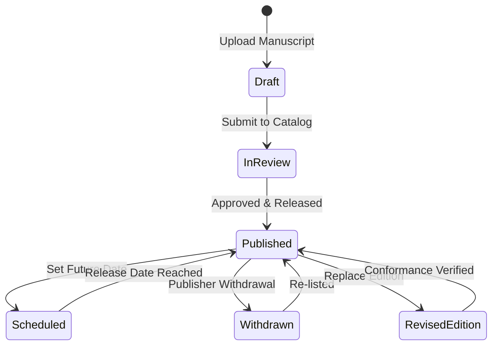

# Publisher Agreement and Terms of Service

This agreement governs the relationship between book publishers, independent authors, and the Granthalay platform. By registering an organization account on `granth-pub` and submitting digital works, publishers agree to the terms set forth herein.

---

## 1. Eligibility and Organization Verification

1. **Qualified Entities**: Publishers must be legally registered corporations, partnerships, sole proprietorships, or individual authors authorized to do business in supported launch jurisdictions.
2. **Accurate Representation**: Publishers must provide verifiable legal business names, valid tax identification numbers (EIN, VAT, or GST), and legitimate contact coordinates.
3. **Account Responsibility**: The publisher organization is solely responsible for all actions conducted under its authorized user credentials (`ADMIN`, `EDITOR`, and `VIEWER` roles).

---

## 2. Intellectual Property and Content Representation

1. **Publisher Retains Full Copyright**: Publishers retain 100% of their copyright, trademark, and intellectual property rights in and to all submitted works. Granthalay does not claim any ownership of publisher content.
2. **License Grant to Platform**:
   - The publisher grants Granthalay a non-exclusive, worldwide (or territory-restricted as designated in metadata), revocable license to:
     - Store and host the digital book assets (EPUB files, cover artwork, and sample excerpts).
     - Display title metadata, blurbs, and sample chapters on the Granthalay storefront.
     - Distribute digital copies to users who complete verified purchases or redeem valid entitlements.
3. **Publisher Warranties**:
   - The publisher warrants that it owns or possesses all necessary rights, licenses, and permissions to publish and distribute the submitted books.
   - Submitted titles must not infringe upon the copyrights, trademarks, privacy, or proprietary rights of any third party.
   - Content must not contain malicious software, malicious scripts embedded in SVG or EPUB archives, unlawful defamatory material, or content prohibited by applicable laws.

---

## 3. Submission, Review, and Quality Standards

1. **Pre-Flight Conformance**: Submitted EPUBs must pass automated packaging, schema, and security checks before publication. Files that fail validation or pose security hazards will be rejected with diagnostic details.
2. **Platform Review**: Granthalay reserves the right to review submissions for technical compatibility, accessibility standards, and terms conformance prior to storefront listing.
3. **Sample Generation**: The publisher authorizes Granthalay to extract and publicly display the table of contents and up to 10% (or publisher-designated chapters) of the manuscript as free storefront preview samples.

---

## 4. Title Withdrawal and Edition Replacement

1. **Storefront Withdrawal**: Publishers may withdraw any active title from the public storefront at any time via `granth-pub`. 
2. **Existing Purchaser Access**: Withdrawal prevents *new* sales, but existing customers who previously acquired an entitlement retain non-exclusive redownload access to their purchased copy in their personal library.
3. **Revised Editions**: If a publisher uploads a revised edition (e.g., to fix errata or formatting), the publisher must provide an auditable changelog. Publishers may choose whether the revision is delivered as a free update to past purchasers or released as a separate, distinct edition.

---

## 5. Termination

Either party may terminate this agreement upon 30 days written notice. In the event of material breach, willful copyright infringement, or fraudulent activity, Granthalay reserves the right to immediately suspend access to `granth-pub` and delist all associated titles.
