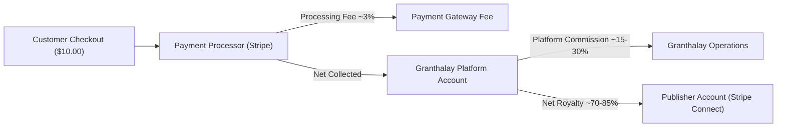
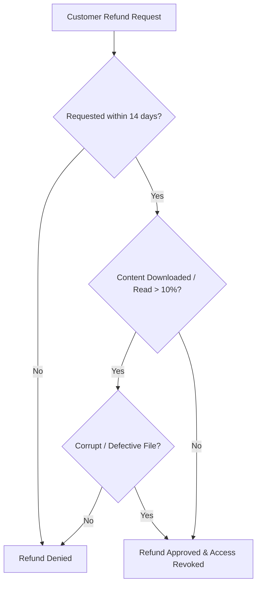

# Commerce, Refunds, and Taxation Policy

This document outlines the commercial framework, royalty structures, digital tax remittance rules, and refund guidelines for transactions processed via Granthalay and managed in `granth-pub`.

---

## 1. Multi-Territory Pricing and Currency Models

Publishers specify catalog pricing across individual geographic territories:

| Parameter | Specification |
| :--- | :--- |
| **Base Currency** | Publisher sets an organization default currency (e.g. `USD`, `EUR`, `GBP`, `INR`). |
| **Territory Pricing** | Supports either **automatic currency conversion** based on real-time forex rates or **explicit fixed territory prices** (e.g. `$9.99 USD`, `€8.99 EUR`, `₹499 INR`). |
| **Minimum Price** | Digital editions must meet the minimum threshold required to clear payment processing fees (e.g. `$0.99 USD`). |
| **Promotional Pricing** | Publishers may schedule temporary discounted pricing windows with automated start and end timestamps. |

---

## 2. Settlement, Royalties, and Payout Schedules

1. **Revenue Share**: Standard digital publishing agreements provide publishers with an agreed net royalty percentage (e.g., 70% to 85% of net proceeds depending on distribution tier).
2. **Payout Methods**: Payouts are executed via **Stripe Connect** (direct deposit / automated bank transfer) to the organization's verified bank account or IBAN.
3. **Payout Cadence**: Net earnings are settled monthly on a `Net-30` schedule (e.g., January royalties are disbursed by the end of February), subject to meeting the minimum payout threshold (default: `$50 USD` or equivalent).
4. **Reserves for Chargebacks**: A rolling reserve (typically 5% of monthly revenue) may be maintained for up to 60 days to cushion against fraudulent chargebacks or payment reversals.

---

## 3. Tax Identification and Digital Tax Compliance

1. **Tax Information Collection**: Prior to disbursing payouts, publishers must complete tax onboarding via `granth-pub` by providing a valid:
   - **United States**: W-9 / W-8BEN form or Employer Identification Number (EIN).
   - **European Union**: Value Added Tax (VAT) Identification Number.
   - **India**: Goods and Services Tax Identification Number (GSTIN) / PAN.
2. **Merchant of Record (MoR) / Marketplace Facilitator**:
   - Granthalay operates as a digital marketplace facilitator where mandated by law.
   - Granthalay calculates, collects, and remits applicable sales taxes, digital service taxes, and VAT directly to tax jurisdictions for storefront consumer purchases.
   - Where the publisher acts as merchant of record, appropriate tax summaries and transaction records are exported through the dashboard for local compliance filing.

---

## 4. Digital Goods Refund Policy

Due to the non-tangible, reproducible nature of digital EPUB books, refunds are administered strictly under the following criteria:

1. **Standard Refund Window**: Customers may request a refund within 14 days of purchase provided the book has not been substantially downloaded or read beyond the sample threshold.
2. **Technical Defects**: In cases where an EPUB file contains unreadable formatting, missing chapters, corrupted files, or inaccurate metadata that the publisher cannot remediate, refunds will be approved upon customer support review.
3. **Refund Impact on Publisher Earnings**: Approved refunds and credit card chargebacks are debited against the publisher's current or subsequent payout cycle. In the event of a refund, the customer's digital reading entitlement is immediately revoked.
