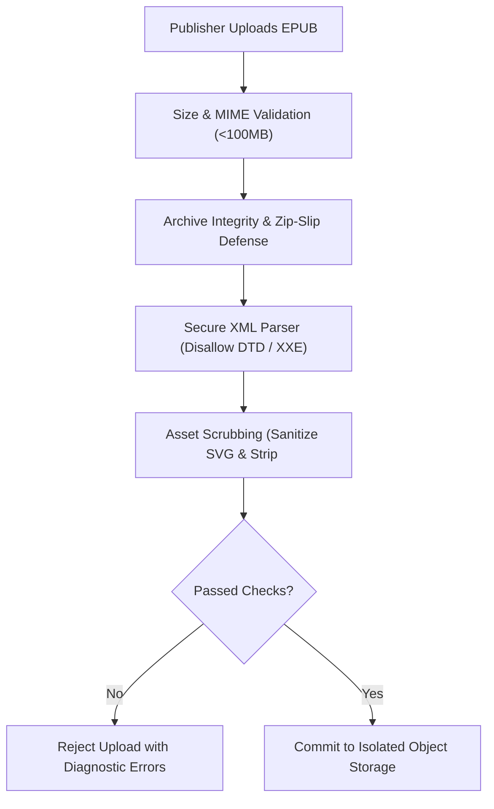

# Security and Incident Response Policy

This document establishes the security architecture, manuscript threat model, role-based access control (RBAC), and incident response procedures for `granth-pub`.

---

## 1. EPUB Ingestion Threat Model

EPUB files are ZIP archives containing XHTML, XML, CSS, images, and fonts. Because untrusted publishers upload files that could potentially compromise administrators or downstream readers, `granth-pub` and `granthalayapi` enforce stringent sanitization and validation barriers:

### Threat Vectors and Mitigations

| Threat | Description | Enforcement Layer |
| :--- | :--- | :--- |
| **Path Traversal ("Zip-Slip")** | Archive entry names attempting relative traversal (e.g. `../../etc/passwd`). | Strict validation ensuring all target extraction paths resolve strictly inside the isolated temporary sandbox directory. |
| **XML External Entity (XXE)** | Malicious XML/OPF files requesting remote or local external entities (`file://`, `http://`). | XML parsers in both frontend previewers and backend ingestors explicitly disable external DTDs and entity expansion (`FEATURE_SECURE_PROCESSING`). |
| **Cross-Site Scripting (XSS)** | Malicious JavaScript injected via XHTML `<script>` tags, inline event handlers, or `<svg>` images. | Strict HTML sanitization via `sanitize-html` and DOMPurify; script tags, dangerous URI schemes (`javascript:`), and executable SVG objects are stripped prior to rendering preview samples. |
| **Decompression Bombs (Zip Bombs)** | Tiny zip files that expand into hundreds of gigabytes. | Maximum decompressed size caps, entry count limits, and bounded compression ratios enforced during unpack. |

---

## 2. Role-Based Access Control (RBAC)

Publisher organizations manage multiple collaborators using isolated role hierarchies:

| Role | Permissions | Restrictions |
| :--- | :--- | :--- |
| **`ADMIN`** | Full organization control: Invite/remove members, manage payout settings, sign terms, withdraw titles, publish releases. | Cannot access other publisher organizations. |
| **`EDITOR`** | Upload manuscripts, edit book catalog metadata, configure territory prices, submit titles for review. | Cannot alter organization tax ID, bank accounts, or invite members. |
| **`VIEWER`** | Read-only access: View catalog listings, review submission statuses, inspect sales and performance analytics. | Cannot upload files, modify prices, or publish changes. |

### Multi-Tenant Isolation
- All database queries and backend API requests enforce tenant isolation by verifying the authenticated user's organization affiliation (`publisher_id`).
- Direct Object References (IDOR) are prevented by cross-referencing tenant ownership on every asset mutation.

---

## 3. Incident Response and Vulnerability Management

In case of suspected security anomalies, data breaches, or critical vulnerabilities:

### Incident Response Runbook

1. **Detection & Triage (Severity Classification)**:
   - **P0 (Critical)**: Exploitable authentication bypass, unauthorized cross-tenant data access, leaked payment provider credentials. Target triage: `< 4 hours`.
   - **P1 (High)**: Malicious EPUB parsing vulnerability, unauthorized status mutation. Target triage: `< 24 hours`.
   - **P2 (Medium)**: Broken UI input validation, non-sensitive metadata exposure. Target triage: `< 72 hours`.

2. **Containment & Emergency Revocation**:
   - In the event of compromised credentials, organization administrators or platform security officers can invoke global session invalidation (`POST /api/v1/auth/sessions/revoke-all`).
   - If an infected manuscript bypasses filters, the system triggers an emergency catalog withdrawal, blacklisting the file hash and invalidating cached CDN assets.

3. **Disclosure Policy**:
   - Security researchers and contributors report issues privately via [GitHub Security Advisories](https://github.com/SamsterZero/Granth-pub/security/advisories/new) in accordance with [`SECURITY.md`](../SECURITY.md).
